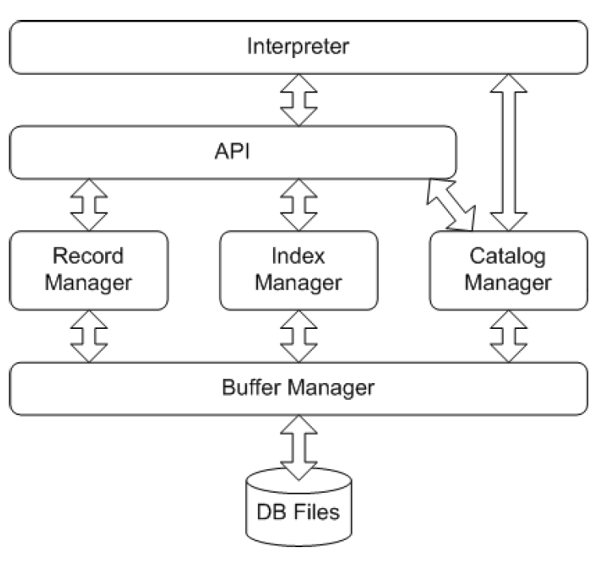
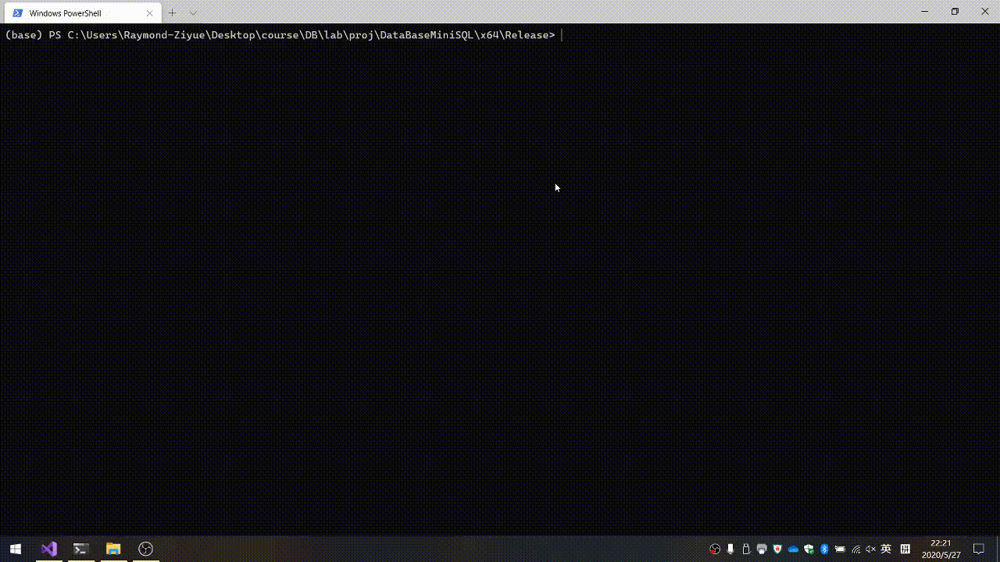

# DataBaseMiniSQL
A project for MiniSQL project





## Interpreter & API

* 全部完成




**API**:

```cpp

//* INSERT INTO..
//* insert_table_name (string) 是待插入的表格
//* insert_values是InsertVal (struct) 的可变数组
//* InsertVal中包括了value (string) 和 given_type (enum)
//* value要使用转换函数进行stoi一类的函数做转换、given_type用来推导关系匹配
//* 
//* 可以考虑增加一些关系自动转换，增加鲁棒性
void InsertQuery::Query() {
	// ... 
}


//* EXECFILE
void ExecFile(string filename) {
	filename.erase(0, 1);
	string final_filename = "";
	vector<string> parse_vec = split(filename, '\\');
	for (int i = 0; i < parse_vec.size(); i++) {
		unsigned int each_char_val;
		stringstream ss;
		ss << hex << parse_vec[i];
		ss >> each_char_val;
		final_filename.push_back(each_char_val);
	}
	//...
}


```